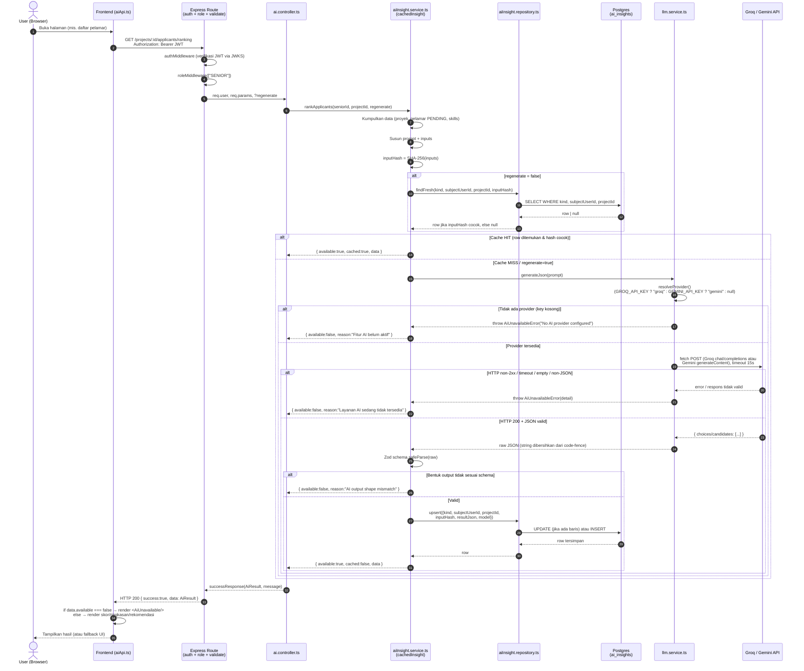

# Arsitektur Integrasi LLM — EduNomad (D-AI-1)

Dokumen ini menjelaskan bagaimana ketiga fitur AI EduNomad (Rekomendasi Portofolio, Peringkat Pelamar, Ringkasan Profil) terhubung ke penyedia LLM eksternal secara **provider-agnostic**, **cache-backed**, dan **gracefully-degrading** — berdasarkan kode aktual di `backend/src/services/llm.service.ts`, `backend/src/services/aiInsight.service.ts`, dan `backend/src/repositories/aiInsight.repository.ts`.

## Komponen yang Terlibat

| Lapisan | File | Tanggung Jawab |
|---|---|---|
| Route | `routes/project.routes.ts`, `routes/user.routes.ts` | `authMiddleware` → `roleMiddleware` → (`requireVerified` khusus BEGINNER) → validasi query `?regenerate=` |
| Controller | `modules/ai/ai.controller.ts` | Tipis — teruskan `req.user.id` + `req.params.id` + flag regenerate ke service, bungkus hasil dengan `successResponse` (selalu HTTP 200) |
| Domain service | `services/aiInsight.service.ts` | Kumpulkan data dari service lain, susun prompt, cek/​tulis cache, validasi output dengan Zod |
| Transport service | `services/llm.service.ts` | Pilih provider (Groq/Gemini), panggil `fetch` mentah, timeout, normalisasi semua kegagalan jadi `AiUnavailableError` |
| Repository | `repositories/aiInsight.repository.ts` | Baca/tulis tabel cache `ai_insights` (Prisma, tanpa native upsert karena `projectId` nullable) |
| Config | `config/env.ts` | `GROQ_API_KEY`/`GEMINI_API_KEY` bersifat **soft** (opsional) — aplikasi tetap boot tanpa key |

## Diagram Sequence (Mermaid)

## Alur Ringkas (poin 1–6 sesuai permintaan)

1. **Client mengirim request** — `frontend/src/services/aiApi.ts` memanggil `apiClient.get(...)` (Axios) dengan header `Authorization: Bearer <supabase JWT>` yang disisipkan otomatis oleh interceptor.
2. **Backend menerima request** — route Express (`project.routes.ts` / `user.routes.ts`) menjalankan `authMiddleware` (verifikasi JWT via JWKS Supabase, isi `req.user`) lalu `roleMiddleware`/`requireVerified` sesuai endpoint, baru diteruskan ke `ai.controller.ts`.
3. **Cek cache (SHA-256)** — `aiInsight.service.ts` menghitung `inputHash = SHA-256(JSON.stringify(inputs))` dari data yang relevan (profil, lowongan, daftar pelamar) lalu memanggil `aiInsightRepository.findFresh()`. Jika baris cache ditemukan **dan** `inputHash`-nya masih sama persis, hasil langsung dikembalikan (`cached:true`) — LLM tidak dipanggil sama sekali.
4. **Jika cache miss → panggil LLM Provider** — `llmService.generateJson()` memilih provider (Groq lebih diutamakan, fallback Gemini) lalu melakukan `fetch` POST langsung ke REST API provider tersebut (tanpa SDK resmi), dengan `AbortController` timeout 15 detik.
5. **Error handling / fallback** — *setiap* jenis kegagalan (key kosong, HTTP non-2xx, timeout, respons kosong, JSON tidak valid, atau output tidak lolos validasi Zod) dinormalisasi menjadi satu jenis error (`AiUnavailableError`) dan **tidak pernah** menjadi HTTP 5xx ke client — service mengembalikan envelope `{ available: false, reason: "..." }` dengan status HTTP tetap **200**.
6. **Response balik ke user** — controller membungkus `AiResult<T>` (baik `available:true` maupun `available:false`) dalam `successResponse()` standar `{ success, message, data }`. Frontend membaca `data.available`: jika `true` menampilkan skor/ringkasan/rekomendasi, jika `false` menampilkan komponen fallback `<AiUnavailable/>` — alur rekrutmen inti (melamar, menyeleksi, submit) tetap berjalan normal tanpa AI.

## Mengapa Integrasi Ini Provider-Agnostic

Sifat *provider-agnostic* dicapai lewat beberapa keputusan desain konkret di `llm.service.ts`:

- **Tidak ada SDK vendor** — kedua provider dipanggil lewat `fetch` HTTP mentah ke endpoint REST masing-masing (`https://api.groq.com/openai/v1/chat/completions` untuk Groq, `https://generativelanguage.googleapis.com/v1beta/models/{model}:generateContent` untuk Gemini). Tidak ada dependency `@google/generative-ai` atau `groq-sdk` yang mengunci implementasi ke satu vendor.
- **Resolusi provider otomatis dari environment**, bukan hardcode: fungsi `resolveProvider()` murni mengecek `env.groqApiKey` lalu `env.geminiApiKey` — provider mana pun yang key-nya terisi otomatis dipakai, tanpa perlu mengubah kode pemanggil. Kedua key bersifat **soft/opsional** (`config/env.ts`) sehingga aplikasi tetap boot walau tidak ada satupun key di-set.
- **Kontrak output yang seragam** — terlepas dari provider, `generateJson<T>()` selalu mengembalikan tipe `Promise<T>` (JSON hasil parse). Perbedaan bentuk respons mentah tiap provider (`choices[0].message.content` untuk Groq vs `candidates[0].content.parts[0].text` untuk Gemini) diserap habis di dalam `callGroq()`/`callGemini()` masing-masing — pemanggil (`aiInsight.service.ts`) sama sekali tidak tahu provider mana yang sedang aktif.
- **Kontrak error yang seragam** — apa pun penyebab kegagalan di provider mana pun (limit kuota, network timeout, response kosong, format tak terduga) selalu dibungkus jadi `AiUnavailableError` yang sama. Lapisan di atasnya (`aiInsight.service.ts`) hanya perlu menangani **satu** jenis exception, bukan error spesifik-SDK per vendor.
- **Validasi output tetap di lapisan domain, bukan di lapisan transport** — `llm.service.ts` hanya menjamin "ini string JSON yang valid secara sintaks"; struktur semantik (field apa saja yang wajib ada) divalidasi terpisah oleh Zod schema di `aiInsight.service.ts` (`portfolioRecSchema`, `rankingSchema`, `summarySchema`). Ini berarti mengganti/menambah provider baru (mis. OpenAI, Claude) hanya butuh menambah satu fungsi `callXxx()` baru + satu cabang di `resolveProvider()`/`generateJson()` — tidak menyentuh domain logic, caching, atau kontrak API sama sekali.
- **Model aktif tercatat untuk provenance** — `llmService.activeModel()` mengembalikan nama model yang sedang dipakai (`env.groqModel` atau `env.geminiModel`) dan disimpan di kolom `ai_insights.model`, sehingga hasil cache tetap bisa ditelusuri provider/model asalnya walau kode pemanggilnya generik.

Efek praktisnya: mengganti provider default (misalnya dari Gemini ke Groq, seperti yang sudah terjadi di project ini) hanya perlu mengubah environment variable `GROQ_API_KEY`/`GEMINI_API_KEY` — nol perubahan kode di `aiInsight.service.ts`, controller, route, atau frontend.
