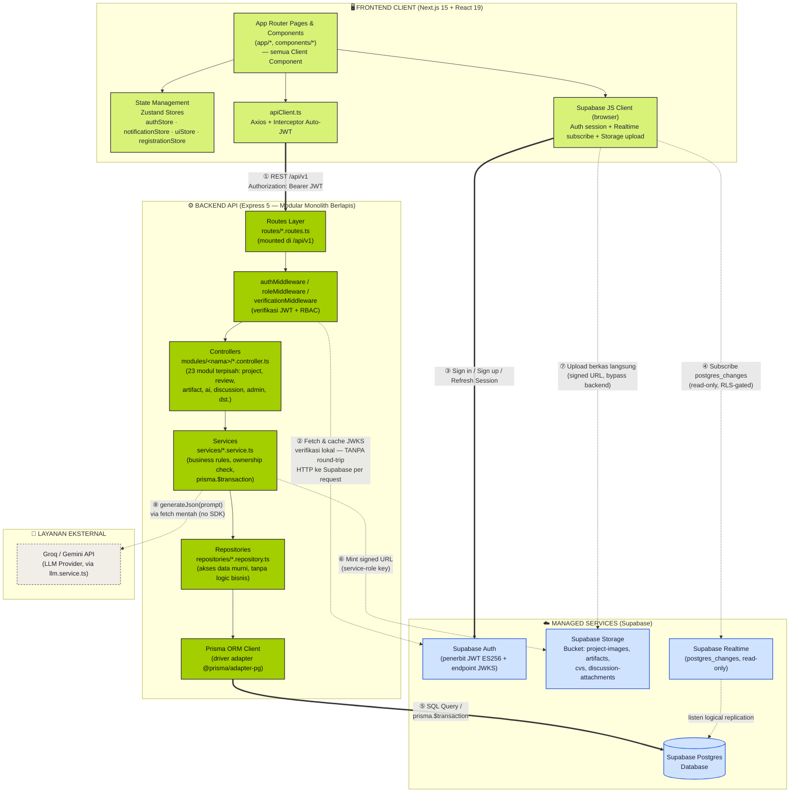
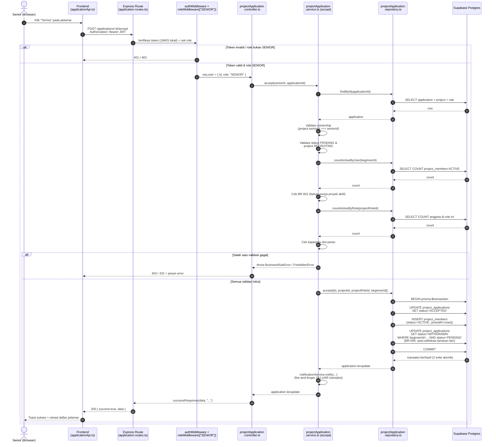

# Arsitektur Sistem — EduNomad

Dokumen ini menjelaskan arsitektur sistem EduNomad secara menyeluruh: bagaimana **Frontend Client (Next.js)**, **Backend API (Express Modular Monolith)**, dan **Managed Services (Supabase & LLM eksternal)** saling terhubung. Seluruh diagram dan penjelasan disusun berdasarkan kode aktual di repository (bukan asumsi), sehingga dapat dijadikan rujukan teknis maupun bahan laporan/skripsi.

---

## 9.1.1 Diagram Arsitektur Sistem Keseluruhan



### Legenda

| Elemen | Arti |
|---|---|
| 🟩 Kotak hijau muda (chartreuse) | Lapisan **Frontend Client** (Next.js, berjalan di browser pengguna) |
| 🟢 Kotak hijau tua | Lapisan **Backend API** (Express, berjalan di server Node.js) |
| 🔵 Kotak biru muda | **Managed Services** Supabase (Auth, Database, Storage, Realtime — dikelola pihak ketiga) |
| ⬜ Kotak putih garis putus | **Layanan eksternal** (LLM Provider — Groq/Gemini) |
| Panah tebal (`==>`) | Komunikasi **sinkron wajib** (request/response HTTP REST, atau SQL/`$transaction`) |
| Panah putus-putus (`-.->`) | Komunikasi **asinkron / read-only / tidak selalu terjadi** (subscribe realtime, upload langsung, pemanggilan LLM opsional, fetch JWKS yang di-cache) |
| Angka bulat (①–⑧) | Urutan interaksi lintas-boundary yang paling representatif (bukan urutan mutlak setiap request) |

---

## 9.1.2 Diagram Alur Transaksi End-to-End (Contoh Kasus: Penerimaan Lamaran Beginner)

Contoh ini dipilih karena melewati **seluruh lapisan** (Frontend → Route → Middleware → Controller → Service → Repository → `prisma.$transaction` → Database) dan menunjukkan bagaimana satu aksi transaksional menyentuh **tiga tabel sekaligus secara atomik**: `project_applications`, `project_members`, dan auto-withdraw lamaran lain (BR-005). Endpoint nyata: `POST /api/v1/applications/:id/accept`.



**Poin penting soal atomisitas:** ketiga operasi tulis (update lamaran → `ACCEPTED`, insert `project_members` baru, update-many lamaran lain → `WITHDRAWN`) dibungkus dalam **satu** `prisma.$transaction` di `repositories/projectApplication.repository.ts`. Jika salah satu gagal (mis. constraint DB), seluruhnya di-rollback — tidak mungkin ada state "lamaran diterima tapi member gagal dibuat". Pengiriman notifikasi sengaja diletakkan **di luar** transaksi karena bukan bagian dari konsistensi data inti (kegagalan kirim notifikasi tidak boleh membatalkan penerimaan lamaran).

---

## Penjelasan Komprehensif

### 1. Arsitektur Backend — Modular Monolith Berlapis

Backend EduNomad adalah **satu aplikasi Express 5** (bukan microservices) yang disusun berlapis secara konsisten untuk setiap resource:

```
Route  →  Controller  →  Service  →  Repository  →  Prisma ORM  →  Supabase Postgres
```

- **Route** (`routes/*.routes.ts`) — hanya mendaftarkan urutan middleware: `authMiddleware` (autentikasi) → `roleMiddleware([...])` (otorisasi role) → `requireVerified`/`requireActiveAccount` (opsional, cek status akun) → `validateRequest({...})` (validasi Zod) → method controller. Tidak ada logika bisnis di sini.
- **Controller** (`modules/<nama>/*.controller.ts`) — tipis, hanya mem-parsing `req`, memanggil satu method service, dan membungkus hasil dengan `successResponse()`/meneruskan error ke `next(err)`. Tidak pernah menyentuh Prisma langsung.
- **Service** (`services/*.service.ts`) — tempat **seluruh business logic**: pengecekan kepemilikan (ownership), validasi business rule (mis. BR-001 "satu proyek aktif", BR-005 "auto-withdraw"), dan orkestrasi multi-langkah. Ketika sebuah aksi harus mengubah lebih dari satu tabel secara atomik, service memanggil method repository yang membungkusnya dalam `prisma.$transaction` (lihat contoh §9.1.2).
- **Repository** (`repositories/*.repository.ts`) — **hanya** query Prisma (select/insert/update/delete), tanpa pengambilan keputusan bisnis. Ini memisahkan "bagaimana cara mengambil/menyimpan data" dari "kapan boleh melakukannya".
- **Prisma ORM** — memakai driver adapter `@prisma/adapter-pg` (bukan default query engine binary), dibungkus sebagai singleton di `config/database.ts` agar tahan terhadap hot-reload development.

**Pemisahan modul** (`modules/`): backend terbagi menjadi **23 modul terpisah** — `admin`, `ai`, `artifact`, `auth`, `category`, `contribution`, `deliverable`, `directMessage`, `discussion`, `experience`, `milestone`, `notification`, `portfolioLink`, `project`, `projectApplication`, `projectLifecycle`, `projectMember`, `projectRole`, `review`, `seniorApplication`, `skill`, `user`, `verification`. Tiap modul hanya berisi controller-nya sendiri (services & repositories tetap berada di folder flat bersama `services/` dan `repositories/` di root `src/`, saling dipanggil antar-modul bila perlu — mis. `projectApplication.service.ts` memanggil `notificationService` dan tiga repository berbeda). Prinsip modular monolith ini memungkinkan pemisahan tanggung jawab yang jelas ala microservices, tanpa biaya operasional deployment terdistribusi (satu proses Node.js, satu database).

Enum status/role secara sengaja disimpan sebagai **VARCHAR biasa** di database (bukan native Postgres enum) — validasi nilai yang diperbolehkan dilakukan di lapisan Zod dan didefinisikan sekali di `constants/*.ts` (mis. `projectStatus.ts`, `applicationStatus.ts`), supaya menambah status baru tidak memerlukan migrasi skema.

### 2. Arsitektur Frontend — Next.js 15 Client-Side Architecture

Seluruh halaman (`app/*`) adalah **Client Component** (`"use client"`) — tidak ada data fetching di Server Component. Pola pengambilan data: `useEffect` di halaman/komponen memanggil salah satu **service object** di `services/*Api.ts` (mis. `projectApi`, `applicationApi`, `aiApi`), yang membungkus panggilan `apiClient.get/post/put/delete(...)`.

**`apiClient.ts`** adalah satu instance Axios bersama dengan dua interceptor:
- **Request interceptor** — sebelum tiap request dikirim, memanggil `supabase.auth.getSession()` untuk mengambil access token **terbaru** (Supabase menangani refresh token secara otomatis di balik layar), lalu menempelkannya sebagai header `Authorization: Bearer <token>`. Ini memastikan token yang dikirim selalu valid meski store lokal belum sempat ter-update.
- **Response interceptor** — menormalkan semua error Axios menjadi tipe `ApiError` (`message`, `status`, `errors`) berdasarkan envelope backend `{ success:false, message, errors }`, sehingga kode pemanggil tidak pernah perlu menangani `AxiosError` mentah.

**State Management (Zustand)** — empat store terpisah, tanpa Redux/Context API manual:
- `authStore` — sesi Supabase, `appUser` (role/status dari `GET /auth/me`), flag `isAuthenticated`/`isLoading`.
- `notificationStore` — daftar notifikasi + `unreadCount` turunan, diisi oleh `NotificationProvider` (lihat §3.2).
- `registrationStore` — state wizard registrasi 5 langkah, di-persist ke `sessionStorage` (bertahan antar-halaman, hilang saat tab ditutup).
- `uiStore` — state UI generik (status sidebar, map modal terbuka/tertutup).

Tidak ada React Query/SWR — caching dan re-fetch data server dilakukan manual per halaman (`load()` dipanggil ulang setelah setiap aksi mutasi berhasil), sejalan dengan filosofi "sederhana dulu" proyek ini.

### 3. Integrasi Supabase & Layanan Eksternal

#### 3.1 Auth Flow

1. `AuthProvider` (dipasang sekali di root layout) subscribe ke `supabase.auth.onAuthStateChange`. Event `INITIAL_SESSION` langsung terpicu saat subscribe (berisi sesi tersimpan atau `null`), sehingga tidak perlu panggilan `getSession()` terpisah yang akan mendobel fetch.
2. Ketika sesi ada, `AuthProvider` memanggil backend `GET /auth/me` untuk mengambil `appUser` (baris `public.users` — role & status aplikasi, yang **tidak** ada di klaim JWT Supabase).
3. Token JWT (ditandatangani ES256 oleh Supabase Auth) dikirim di setiap request backend via header `Authorization`.
4. Di backend, **`authMiddleware`** memverifikasi token **secara lokal** menggunakan `jose`'s `createRemoteJWKSet` + `jwtVerify` (`config/jwt.ts`) terhadap endpoint `{SUPABASE_URL}/auth/v1/.well-known/jwks.json`. Kunci publik (JWKS) di-fetch sekali lalu **di-cache otomatis oleh library** (dengan refresh otomatis saat rotasi kunci) — artinya **tidak ada round-trip HTTP ke server Supabase Auth pada setiap request** seperti pola `supabase.auth.getUser()`; verifikasi signature + expiry murni terjadi di proses backend sendiri. Ini keputusan performa yang eksplisit (lihat komentar di `config/jwt.ts`).
5. Setelah token valid, `authMiddleware` memuat baris `public.users` yang sesuai (`sub` klaim = `users.id`) untuk mendapatkan `role`/`status`, lalu mengisi `req.user`. Kombinasi role (`roleMiddleware`) dan status akun (`verificationMiddleware`) inilah yang menjadi dasar RBAC di setiap endpoint.

#### 3.2 Realtime Flow

Dua konsumen Supabase Realtime, keduanya **read-only** (client tidak pernah menulis langsung ke tabel):
- **`NotificationProvider`** — subscribe channel `notif-<userId>` pada event `postgres_changes` (`INSERT` di tabel `notifications`, difilter `user_id=eq.<id>`). Payload realtime dipercaya langsung untuk merender notifikasi baru + toast.
- **`ChatPanel`** (dipakai oleh diskusi grup & pesan langsung) — subscribe channel serupa per percakapan. Berbeda dari notifikasi, saat ada `INSERT` baru, komponen ini **tidak** memakai payload mentahnya, melainkan memicu **re-fetch penuh** lewat Express — karena render pesan butuh resolusi nama pengirim dan aturan visibilitas yang tidak terbawa di payload Postgres mentah.

Semua **penulisan** (kirim pesan, dsb.) tetap lewat Express backend (Prisma memakai service-role key yang **bypass RLS**); baca real-time via klien browser dibatasi oleh Row Level Security (RLS) khusus tabel yang relevan (discussion, notifications) sehingga user hanya menerima event yang memang berhak dilihat.

#### 3.3 Storage Flow

Prinsip **"jangan simpan file biner di database"** (aturan proyek) diterapkan konsisten via pola *signed URL*:
1. Frontend meminta backend menyediakan URL upload (mis. `POST /projects/image-upload-url`).
2. Backend (`services/storage.service.ts`, memakai `supabaseAdmin` service-role) memanggil `createSignedUploadUrl()` ke bucket Supabase Storage yang sesuai (`project-images`, `discussion-attachments`, dll.) dan mengembalikan `{ path, token, signedUrl }`.
3. **Browser meng-upload file langsung ke Supabase Storage** menggunakan signed URL tersebut (`supabase.storage.from(bucket).uploadToSignedUrl(...)`) — byte file **tidak pernah lewat server Express**, mengurangi beban bandwidth backend.
4. Setelah upload sukses, frontend mengirim **hanya string path/URL** hasil upload itu ke backend (mis. sebagai field `imageUrl` saat membuat/mengedit proyek). Repository backend menyimpan string tersebut ke kolom database (`projects.image_url`, dsb.) — sama sekali tidak ada BLOB/binary di Postgres.
5. Untuk bucket privat (mis. sertifikat `artifacts`, lampiran diskusi), pembacaan file memakai `createSignedUrl()` dengan TTL terbatas (mis. 1 jam) yang di-mint ulang oleh backend setiap kali diperlukan — bukan URL publik permanen.

### 4. Alur Proses End-to-End — Contoh Kasus Transaksional

Diagram sequence di §9.1.2 di atas menggambarkan aksi **"Senior menerima lamaran Beginner"** secara utuh:

1. **Frontend** mengirim `POST /applications/:id/accept` melalui `apiClient.ts` (JWT otomatis tertempel).
2. **Route + Middleware** memverifikasi identitas (JWKS lokal) dan memastikan role pemanggil adalah `SENIOR`, sebelum request menyentuh logika apa pun.
3. **Controller** meneruskan `seniorId` & `applicationId` ke **Service**.
4. **Service** menjalankan serangkaian validasi business rule secara berurutan — kepemilikan proyek (hanya senior lead proyek tsb.), status lamaran harus `PENDING`, status proyek harus `RECRUITING`, BR-001 (beginner belum aktif di proyek lain), dan kapasitas slot peran belum penuh — masing-masing memanggil **Repository** yang berbeda untuk membaca data terkini dari **Database**.
5. Jika semua validasi lolos, Service memanggil **satu** method Repository (`accept()`) yang membungkus **tiga operasi tulis** dalam **`prisma.$transaction`**: update status lamaran, insert baris keanggotaan baru (`ProjectMember`, status `ACTIVE`), dan auto-withdraw lamaran `PENDING` lain milik beginner yang sama (BR-005). Ketiganya sukses atau gagal bersama — menjamin **konsistensi data** meski terjadi crash di tengah proses.
6. Setelah transaksi commit, Service mengirim notifikasi (operasi terpisah, di luar transaksi, "fire-and-forget") sebagai efek samping non-kritis.
7. **Response** mengalir kembali ke atas melalui envelope standar `{ success, message, data }`, dan **Frontend** menampilkan toast sukses lalu memuat ulang daftar pelamar dari server (bukan optimistic update lokal) — menjaga tampilan selalu sinkron dengan state sebenarnya di database.

Pola yang sama berlaku untuk aksi transaksional lain di sistem, misalnya **pembuatan proyek** (`POST /projects`, single insert dengan pengecekan business rule "UMKM maksimal 5 proyek aktif" sebelum insert) atau **penyelesaian proyek** (`POST /projects/:id/complete`, transaksi yang mengubah status proyek + status seluruh anggota `ACTIVE` sekaligus + menulis audit log) — seluruhnya konsisten mengikuti alur lapisan yang sama seperti digambarkan di §9.1.1.
