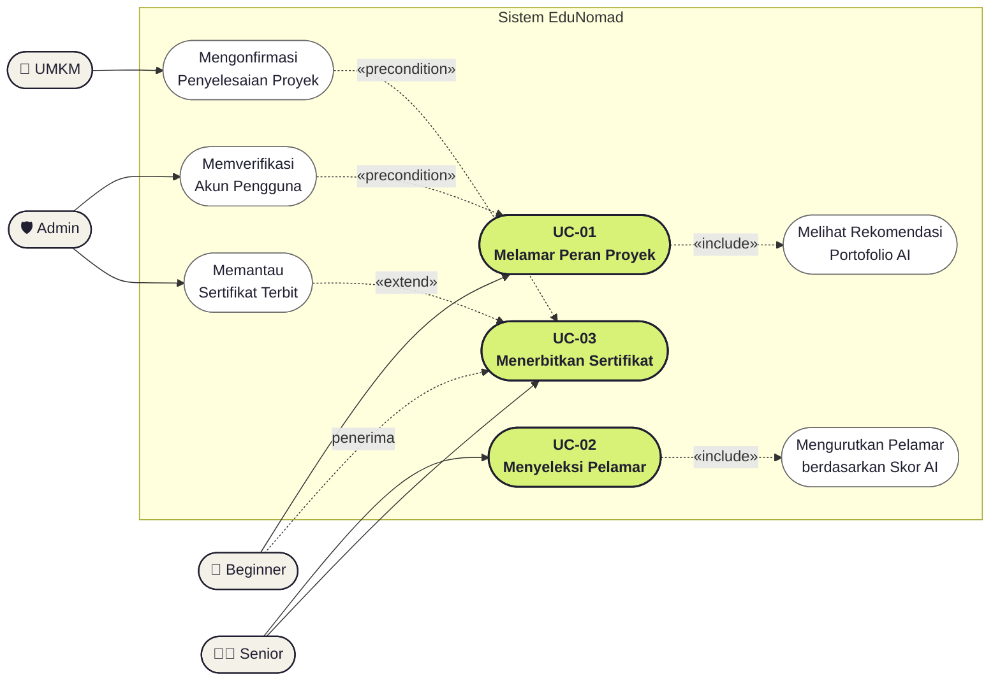

# Use Case Diagram — EduNomad

Dokumen ini menggambarkan diagram use case tingkat tinggi EduNomad beserta skenario naratif untuk tiga use case utama: **Melamar Peran Proyek (UC-01)**, **Menyeleksi Pelamar (UC-02)**, dan **Menerbitkan Sertifikat (UC-03)**.

## Diagram Use Case

**Keterangan notasi:**
- Kotak pil hijau (chartreuse) = tiga use case utama (UC-01, UC-02, UC-03).
- Kotak pil putih = use case pendukung (sub-flow/dependensi) yang relevan agar relasi antar aktor terlihat lengkap.
- Panah solid = relasi asosiasi langsung aktor → use case.
- Panah putus-putus `«include»` = sub-langkah yang selalu dijalankan sebagai bagian dari use case utama (mis. rekomendasi AI dijalankan di dalam alur melamar/menyeleksi).
- Panah putus-putus `«extend»` = perilaku opsional yang memperluas use case utama (mis. Admin memantau sertifikat yang sudah terbit).
- Panah putus-putus `«precondition»` = use case yang harus terjadi lebih dulu agar use case utama dapat dijalankan (mis. Admin memverifikasi akun sebelum Beginner bisa melamar; UMKM mengonfirmasi penyelesaian proyek sebelum sertifikat diterbitkan).

---

## 6.4 Skenario Use Case

### 6.4.1 Use Case: Melamar Peran Proyek (Beginner)

| Field | Keterangan |
|---|---|
| **ID** | UC-01 |
| **Nama** | Melamar peran proyek |
| **Aktor** | Beginner |
| **Deskripsi** | Beginner melamar salah satu peran pada proyek RECRUITING, dibantu rekomendasi portofolio AI. |
| **Precondition** | Akun VERIFIED, belum memiliki proyek AKTIF, proyek berstatus RECRUITING. |
| **Postcondition** | Lamaran tercatat berstatus PENDING. |

**Skenario Normal:**
1. Beginner membuka detail proyek.
2. Beginner memilih peran yang tersedia.
3. Sistem menampilkan rekomendasi portofolio AI (opsional dilihat).
4. Beginner mengisi motivasi.
5. Beginner mengirim lamaran.

**Skenario Alternatif:**
- Beginner sudah memiliki proyek AKTIF → sistem menolak lamaran (aturan satu proyek aktif).

### 6.4.2 Use Case: Menyeleksi Pelamar (Senior)

| Field | Keterangan |
|---|---|
| **ID** | UC-02 |
| **Nama** | Menyeleksi pelamar |
| **Aktor** | Senior (lead) |
| **Deskripsi** | Senior meninjau daftar pelamar, mengurutkan berdasarkan skor kecocokan AI, lalu menerima/menolak. |
| **Precondition** | Senior adalah mentor proyek; ada pelamar PENDING. |
| **Postcondition** | Pelamar diterima menjadi anggota ACTIVE / ditolak. |

**Skenario Normal:**
1. Senior membuka halaman pelamar.
2. Senior mengaktifkan urutan berdasarkan kecocokan AI.
3. Senior meninjau skill yang cocok/kurang beserta alasannya.
4. Senior menerima atau menolak pelamar.

**Skenario Alternatif:**
- LLM tidak tersedia → daftar pelamar tetap tampil tanpa skor (fallback).

### 6.4.3 Use Case: Menerbitkan Sertifikat (Sistem/Senior)

| Field | Keterangan |
|---|---|
| **ID** | UC-03 |
| **Aktor** | Senior, Sistem |
| **Deskripsi** | Setelah proyek memenuhi syarat penyelesaian, sertifikat per Beginner diterbitkan dengan QR verifikasi. |
| **Precondition** | Deliverable & kontribusi APPROVED, review lengkap. |
| **Postcondition** | Artefak terbit; dapat diverifikasi di `/verify/:code`. |
